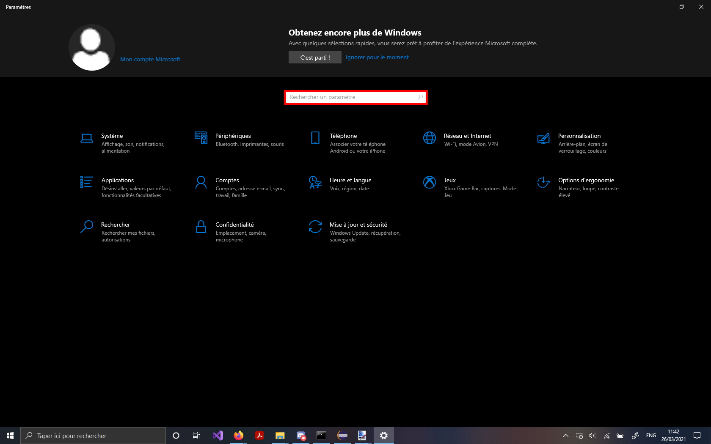

Programmation Java @ Et3
<br>
Polytech Paris-Saclay | 2020-21

___

Voici un petit tutoriel pour configurer la commande *java*.

Ce tutoriel vous sera utile si, en entrant la commande :
```
java MaClasseCompilee
```
vous rencontrez le message:
```
bash: java: command not found
```

# Configuration pour windows

1. Connectez-vous sur le [site de Oracle dans la rubrique *Java SE Downloads*](https://www.oracle.com/fr/java/technologies/javase-downloads.html) et téléchargez le fichier *.exe* correspondant à la version de java que vous souhaitez installer.

> Ici, on télécharge la [version 11](https://www.oracle.com/fr/java/technologies/javase-jdk11-downloads.html)
> 
> <br><div align="center"></img></div><br>

1bis. Acceptez les conditions d'utilisation et cliquez sur le bouton de téléchargement 

> <br><div align="center"></img></div><br>

2. Allez dans vos téléchargements et lancez votre fichier *.exe*

> <br><div align="center"></img></div><br>
> 
> Vous devrez accepter que l'application apporte des modifications à votre ordinateur.

3. Complétez l'installation

> <br><div align="center"></img></div><br>
> 
> <br><div align="center"></img></div><br>
> 
> <br><div align="center"></img></div><br>
> 
> <br><div align="center"></img></div><br>
> 
> <br><div align="center"></img></div><br>

3. Allez dans les paramètres Windows

> <br><div align="center"></img></div><br>

4bis. Cherchez "variables environnement" et cliquez sur "*Modifier les variables d'environnement système*"

> <br><div align="center"></img></div><br>

5. Une fois la fenêtre de "*Propriétés système*" ouverte, cliquez sur "*Variables d'environnement ...*"

> <br><div align="center"></img></div><br>

6. Cherchez le répertoire */bin* de votre version de Java

> <br><div align="center"></img></div><br>

6bis. Dans les variables utilisateur, double-cliquez sur "*Path*"

> <br><div align="center"></img></div><br>

6ter. Cliquez sur "*Nouveau*" pour ajouter un chemin 

> <br><div align="center"></img></div><br>

6quater. Entrez le chemin vers le répertoire */bin* de votre version de Java et validez en cliquant sur "*Ok*"

> <br><div align="center"></img></div><br>

7. Cherchez le répertoire principal de votre version de Java

> <br><div align="center"></img></div><br>

7bis. Dans les variables système, cliquez sur "*Nouvelle...*"

> <br><div align="center"></img></div><br>

7ter. Entrez "JAVA_HOME" comme nom de variable et ajoutez le chemin vers le répertoire principal de votre version de Java comme valeur de cette variable, puis, cliquez sur "*Ok*"

> <br><div align="center"></img></div><br>

8. Fermez les fenêtres "*Variables d'environnement*" et "*Propriétés système*"

> <br><div align="center"></img></div><br>
> 
> <br><div align="center"></img></div><br>

9. Utilisez la commande ```java``` depuis le répertoire bin de votre projet en spécifiant le nom de la classe qui doit être utilisée (sans le *.class*)

> <br><div align="center"></img></div><br>
